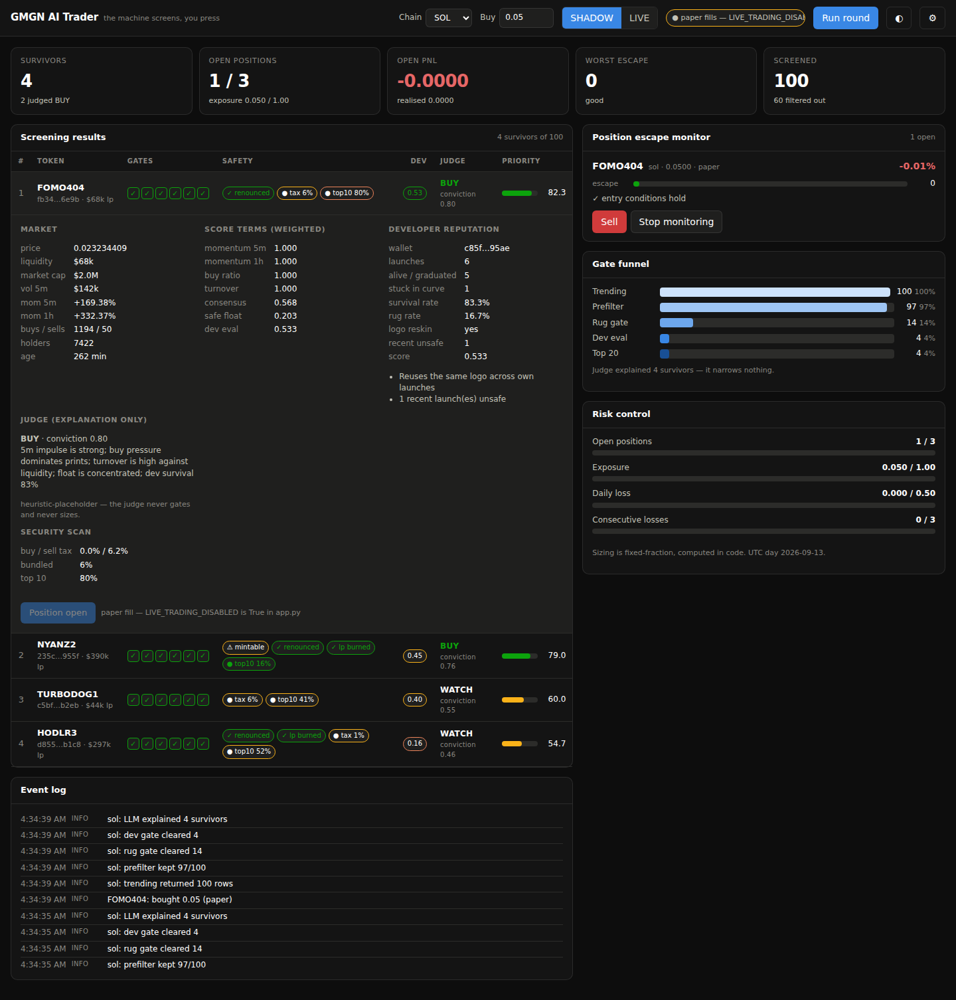

# GMGN AI Trader (local)

A local memecoin screening and trading dashboard. **The machine screens, the human
presses to trade.** Deterministic rules cast a wide net, scoring cuts hard, a judge
only explains the survivors, and nothing is bought without an explicit click.

Built from the [aitrader SPEC](https://github.com/alphaexa48/skillmarket-demos/blob/main/aitrader/SPEC.en.md).



## Run it

```bash
pip install -r requirements.txt
python app.py                      # http://127.0.0.1:8000
```

It binds to `127.0.0.1` only and runs standalone on the built-in `MockGMGN`
adapter — no credentials, no network, no on-chain writes. Press **Run round**.

Tests:

```bash
pip install -r requirements-dev.txt
python -m pytest ../test/unit -q
```

## Safety model

Three independent locks sit between the UI and a real order. **All three must
open**, and the first one is a source edit:

| Lock | Where | Default |
|---|---|---|
| `LIVE_TRADING_DISABLED` | top of `app.py` | `True` — seals every on-chain write |
| LIVE / SHADOW mode | UI toggle, confirmation required | `SHADOW`, and resets to SHADOW on every restart |
| Adapter | Settings dialog | `MockGMGN`, which raises rather than sign, even if asked |

`GET /api/status` reports `trading_locked` and the exact `lock_reason`. While any
lock holds, buys and sells are paper fills: logged in full, `simulated: true`, no
signing key touched.

### Arming live trading

Real money is irreversible and the `gmgn-cli` subcommand shapes below are the
documented 1.3.9 surface, **not verified against a live CLI here**. Before flipping
the switch:

1. Install the CLI (`pip install gmgn-cli==1.3.9`) and confirm `gmgn-cli trade buy --help`
   matches the templates in `adapters.py` (`GmgnCliAdapter.DEFAULT_COMMANDS`). If it
   doesn't, override them — no code edit needed — via `GMGN_BUY_CMD` / `GMGN_SELL_CMD`
   in `~/.config/gmgn/.env`, or the Settings dialog.
2. Set the adapter to `gmgn-cli` and save your API key and signing key.
3. Check the exact argv that would run, which signs nothing:
   `curl '127.0.0.1:8000/api/preflight?chain=sol&address=<TOKEN>&amount=0.01'`
4. Only then set `LIVE_TRADING_DISABLED = False` in `app.py`, restart, and toggle LIVE.
5. Start with a size far below your risk tolerance and confirm the transaction hash
   lands in `outputs/trade_decisions.jsonl`.

Solana is the tested path. BSC / Base / ETH screen correctly but have **never been
exercised with live funds** — treat them as unverified.

## Pipeline

```
trending (1 call) → prefilter 100 rows → deterministic rug gate
  → momentum ranking → dev reputation gate → top 20
  → judge explains → code computes size → [you click]
```

Priority score, rescaled to 0–100:

```
5m momentum·30 + 1h momentum·12 + buy/sell ratio·18 + turnover·12
  + consensus·12 + safe float·10 + dev eval·12
```

A token bleeding on the hour (`1h < -12%`) takes a 0.4× sink.

**Developer reputation** (0–1) is both a ranking term and a hard filter at 0.15.
Its base is the per-token survival rate — graduated / (graduated + stuck-in-curve),
where ~1% marks a token factory — minus penalties for a stuck-in-curve backlog,
recent unsafe launches, logo reuse **across the dev's own tokens only**, and an
exited wallet. A creator whose art was stolen by strangers is not penalised, and
handle-change history is ignored.

**The judge has no gating authority.** It labels survivors BUY / WATCH / SKIP with
a conviction and a sentence of reasoning. It never advances a token and never
returns a size. `pipeline.heuristic_explain` is the placeholder; swap in a real
model by passing any `explainer(candidate) -> dict` to `pipeline.screen`.

**Escape monitoring is separate from screening.** Each position keeps its entry
snapshot; severity (0–100) accumulates only from measured degradation against it —
honeypot triggered after entry, mint authority returned, renounce revoked, transfers
frozen, top-10 concentration spike, sell-tax spike. At ≥ 70 the row pulses.

**Risk control is pure code.** Max concurrent positions, total exposure cap, daily
loss cap, and a consecutive-loss kill-switch are all checked at trade time. Size is
fixed-fraction (`risk amount / stop distance`), clipped by the remaining exposure
headroom — never an LLM's suggestion.

## API

All endpoints bind to `127.0.0.1:8000`.

| Method | Path | Purpose |
|---|---|---|
| GET | `/api/status` | adapter, chain, mode, key presence, trading lock + reason |
| POST | `/api/config` | write `.env` credentials, switch adapter, override order commands |
| POST | `/api/mode` | toggle LIVE / SHADOW (`confirm: true` required for LIVE) |
| GET | `/api/settings?chain=sol` | trending command for a chain |
| POST | `/api/settings` | persist a custom trending command (prefix-validated) |
| POST | `/api/run` | one screening round → candidates, rejects, funnel, positions, risk |
| GET | `/api/preflight` | exact argv a LIVE order would run; signs nothing |
| POST | `/api/buy` | risk gate, then order; polls for a real fill and keeps the tx hash |
| POST | `/api/sell` | close a position |
| POST | `/api/unmonitor` | keep the position, stop polling it |
| POST | `/api/risk/reset` | clear a tripped kill-switch |
| GET | `/api/log` | recent events and the decision log |

## Multi-chain

Chain is a per-request dimension, not global state. Adapters and the 3-second
trending cache are keyed per chain; each browser tab keeps its own chain in
`sessionStorage`, so two tabs can watch two chains without interfering. Position
and risk state stay wallet-level, unified across chains.

## Files

| Path | Role |
|---|---|
| `app.py` | master switch, FastAPI routes, adapter cache, trading flow |
| `adapters.py` | `MockGMGN` and `GmgnCliAdapter`; write guards live here |
| `pipeline.py` | gates, scoring, dev reputation, judge, round orchestration |
| `positions.py` | entry snapshots and the escape monitor |
| `risk.py` | hard limits, kill-switch, fixed-fraction sizing |
| `store.py` | `.env`, positions, decision log, per-chain commands |
| `static/index.html` | the single-file dashboard |

Runtime state lands in `outputs/` (git-ignored): `positions.json`,
`trade_decisions.jsonl` (append-only SCREEN/FILTER/BUY/SELL/UNMONITOR),
`trending_cmds.json`, `risk_state.json`. Credentials live in `~/.config/gmgn/.env`
at mode 600, outside the project.

`PUBLIC_DEMO=1` collapses the app to read-only: cached screening results, no
position data, every write endpoint 403s.

## Deliberate deviations from the SPEC

- **Security-scan budget.** Rug-gating all 100 prefiltered rows would be 100 CLI
  calls per round. Rows are presorted on the momentum terms that need no extra call
  and the gate scans the best 40. Everything below the budget is marked `skipped`,
  never `passed`.
- **Risk state is persisted.** The SPEC lists this as not implemented. A kill-switch
  that resets on page reload is a hole, so `outputs/risk_state.json` carries the
  daily loss and consecutive-loss counters across restarts.
- **Max concurrent positions defaults to 3**, the SPEC's stated production value,
  rather than the 20 it was relaxed to. Raise it in `risk.LIMITS` deliberately.
- **Five funnel stages are drawn, not six.** The judge explains every finalist and
  narrows nothing, so it is shown as an annotation instead of a stage that implies
  a cut.

## Not implemented

Auto stop-loss / take-profit orders, dedup of multi-event coins, a liquidity-drop
escape signal, a real LLM judge, and the ML ranker that would replace the momentum
weighting. The decision log already records the training data those would need.
